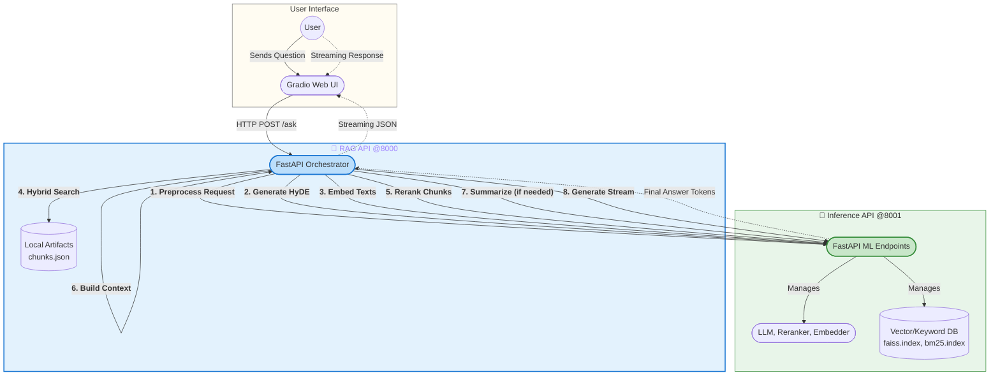

# Decoupled Adaptive RAG Engine

[](https://github.com/KareemSayed1232/Decoupled-Adaptive-Rag-Engine/blob/main/LICENSE)
[](https://www.python.org/downloads/)
[](https://github.com/psf/black)
[](https://github.com/KareemSayed1232/Decoupled-Adaptive-Rag-Engine/stargazers)

A powerful, adaptive Retrieval-Augmented Generation (RAG) system built with a decoupled microservices architecture. This project separates the core AI/ML inference tasks from the business logic, making it scalable, maintainable, and easy to develop.

## Table of Contents

- [Architecture Overview](#architecture-overview)
- [Key Features](#key-features)
- [RAG Techniques and Innovations](#rag-techniques-and-innovations)
- [Technology Stack](#technology-stack)
- [Getting Started on Windows](#getting-started-on-windows)
  - [Prerequisites](#prerequisites)
  - [Step 1: System-Level Setup (C++ & CUDA)](#step-1-system-level-setup-c--cuda)
  - [Step 2: Project & Environment Setup](#step-2-project--environment-setup)
  - [Step 3: Install Core AI Dependencies](#step-3-install-core-ai-dependencies)
  - [Step 4: Configure the Project](#step-4-configure-the-project)
  - [Step 5: Install Project Dependencies](#step-5-install-project-dependencies)
  - [Step 6: Build Search Artifacts](#step-6-build-search-artifacts)
  - [Step 7: Run the Application](#step-7-run-the-application)
- [Project Structure](#project-structure)
- [Contributing](#contributing)
- [License](#license)
- [Contact](#contact)

## Architecture Overview

This project implements a microservices pattern to create a clear separation of concerns. The user interacts with a web client, which communicates with an orchestration API. This API, in turn, offloads all heavy ML computations to a dedicated, independently scalable inference API.



## Key Features

-   **Fully Decoupled Services**: Scale, develop, and deploy the UI, logic, and ML services independently.
-   **Real-Time Streaming**: Delivers responses token-by-token for a dynamic and interactive user experience.
-   **Adaptive Context Strategy**: Intelligently builds the final context for the LLM based on retrieval confidence.
-   **Hybrid Search**: Combines dense and sparse retrieval methods for more robust and accurate results.
-   **Clean API Design**: Uses Pydantic for data validation and a shared data models package for type-safe communication.

## RAG Techniques and Innovations

This engine employs a multi-stage RAG pipeline that incorporates several advanced techniques to enhance accuracy and relevance.

-   **Query Expansion with HyDE (Hypothetical Document Embeddings)**: Before retrieval, the engine uses a smaller LLM to generate a hypothetical document that answers the user's question. Embedding both the query and this document significantly improves the semantic richness of the search.
-   **Hybrid Search (Dense + Sparse Retrieval)**: The system combines the strengths of dense, semantic search (FAISS) with traditional sparse, keyword-based search (BM25) to ensure both meaning and specific terms are captured.
-   **Cross-Encoder Reranking**: A powerful cross-encoder model directly compares the query and each retrieved document, providing a much more accurate relevance score to filter out noise and promote the best possible context.
-   **Adaptive Context Strategy**: The engine uses the top reranker score to make an intelligent decision: provide a rich context for high-confidence results, summarize low-confidence results to distill key facts, or reject the context entirely to prevent hallucination.

## Technology Stack

This project is built with a modern stack of technologies, chosen for performance, scalability, and ease of development.

| Category                  | Technology / Library                                                              | Purpose                                                               |
|---------------------------|-----------------------------------------------------------------------------------|-----------------------------------------------------------------------|
| **Backend & API**         | `FastAPI`, `Uvicorn`                                                              | Building high-performance, asynchronous APIs for both services.       |
| **AI / Machine Learning** | `llama-cpp-python`, `Sentence Transformers`, `mxbai-rerank`, `Transformers`       | Running the LLM, generating embeddings, and reranking documents.      |
| **Vector & Keyword Search** | `Faiss`, `rank_bm25`                                                              | Performing efficient similarity search and keyword-based retrieval.   |
| **Frontend / UI**         | `Gradio`                                                                          | Creating a rapid, interactive web interface for the chat application. |
| **Data & Configuration**  | `Pydantic`, `pydantic-settings`                                                   | Data validation, type safety in APIs, and environment configuration.  |
| **Communication**         | `HTTPX`                                                                           | Asynchronous HTTP client for communication between services.          |

## Getting Started on Windows

This guide provides a detailed, step-by-step process to ensure a smooth setup on Windows, avoiding common compilation and environment issues.

### Prerequisites

-   An NVIDIA GPU with CUDA support.
-   **Git**: [Download here](https://git-scm.com/download/win)
-   **Conda (Miniconda)**: [Download here](https://docs.anaconda.com/free/miniconda/miniconda-install/)
-   **Python 3.11**: Will be installed via Conda.

### Step 1: System-Level Setup (C++ & CUDA)

Correctly installing the C++ compiler and CUDA Toolkit is the most critical step.

#### 1. Install Visual Studio 2022

`llama-cpp-python` requires a C++ compiler.

1.  Download the **Visual Studio 2022 Community** installer from the [official website](https://visualstudio.microsoft.com/downloads/).
2.  Run the installer. On the **Workloads** tab, select **"Desktop development with C++"**.
3.  **Do not click Install yet.** Go to the **Individual components** tab.
4.  Find and select an older C++ toolset for maximum compatibility with CUDA. A good choice is **"MSVC v143 - VS 2022 C++ x64/x86 build tools (v14.38...)"**. This ensures that even if CUDA doesn't support the absolute latest compiler, a compatible one is available.
5.  Click **Install** and wait for the process to complete.

#### 2. Install NVIDIA CUDA Toolkit

1.  Check your NVIDIA driver's supported CUDA version by opening PowerShell and running `nvidia-smi`.
2.  Download the matching **CUDA Toolkit** (e.g., v12.4) from the [NVIDIA Developer website](https://developer.nvidia.com/cuda-toolkit-archive).
3.  Run the installer. When prompted, choose the **Custom (Advanced)** installation.
4.  Ensure that **"Visual Studio Integration"** is checked. This is crucial.
5.  Complete the installation. A system reboot is recommended.

### Step 2: Project & Environment Setup

1.  **Clone the Repository**
    Open a terminal (like PowerShell or Command Prompt) and run:
    ```bash
    git clone https://github.com/KareemSayed1232/Decoupled-Adaptive-Rag-Engine.git
    cd Decoupled-Adaptive-Rag-Engine
    ```

2.  **Create and Activate Conda Environment**
    ```bash
    conda create -n rag_env python=3.11 -y
    conda activate rag_env
    ```

### Step 3: Install Core AI Dependencies

These packages require special compilation flags to enable GPU acceleration.

> **Note:** All the following commands should be run in a terminal **with the `rag_env` environment activated**.

#### 1. Install `llama-cpp-python` with GPU Support

This step compiles the library to use your NVIDIA GPU.

```powershell
# Set environment variables for the build process (PowerShell syntax)
$env:CMAKE_ARGS="-DGGML_CUDA=on"
$env:FORCE_CMAKE="1"

# Install the package with verbose output to see the build process
pip install --force-reinstall --no-cache-dir llama-cpp-python
```

**Verification:** Run this Python command to confirm success.
```powershell
python -c "from llama_cpp import llama_supports_gpu_offload; print(f'llama-cpp-python CUDA support: {llama_supports_gpu_offload()}')"
```
You should see: `llama-cpp-python CUDA support: True`

#### 2. Install PyTorch with GPU Support

PyTorch is needed for the embedding and reranker models.

1.  Find your CUDA version (e.g., 12.4).
2.  Go to the [PyTorch website](https://pytorch.org/get-started/locally/) and find the correct installation command for your system (select Pip, your OS, and your CUDA version).
3.  Run the command. For CUDA 12.4, it would be:
    ```bash
    pip install torch torchvision torchaudio --index-url https://download.pytorch.org/whl/cu124
    ```

**Verification:** Run this Python command to confirm success.
```powershell
python -c "import torch; print(f'PyTorch CUDA support: {torch.cuda.is_available()}')"
```
You should see: `PyTorch CUDA support: True`

### Step 4: Configure the Project

All project settings are managed in a single `.env` file.

1.  Create your local copy from the example file:
    ```powershell
    # In PowerShell
    Copy-Item .env.example .env
    ```
2.  Open the new `.env` file in a text editor.
3.  **Update the required paths** 
#### **Required Settings**
These paths **must be updated** to point to the location of your downloaded GGUF model files on your local machine.

| Variable            | Description                                      | Example Value                               |
|---------------------|--------------------------------------------------|---------------------------------------------|
| `LLM_MODEL_PATH`    | Path to the main Large Language Model file.      | `data/models/guff/Qwen3-8B-Q5_K_M.gguf`       |
| `HYDE_MODEL_PATH`   | Path to the smaller LLM used for HyDE.           | `data/models/guff/Phi-3-mini-4k-instruct-Q4_K_M.gguf` |

These paths **must be updated** to point to the location of custom 'knowledge base' / 'data' on your local machine.

| Variable                  | Description                                                                | Example Value |
|---------------------------|----------------------------------------------------------------------------|---------------------------------------------|
| `BASE_CONTEXT_FILE`       | Path to your base context which is an introduction about the business      | `data/base_context.txt`|
| `COMPLETE_CONTEXT_FILE`   | Path to your complete context and full knowledge about the business        | `data/complete_context.txt` |
### Step 5: Install Project Dependencies

With the core AI libraries installed, install the remaining application packages.

```bash
# 1. Install the shared data models package (editable mode)
pip install -e ./packages/shared-models

# 2. Install dependencies for each service
pip install -r services/inference_api/requirements.txt
pip install -r services/rag_api/requirements.txt
pip install -r clients/gradio-demo/requirements.txt
```

### Step 6: Build Search Artifacts

This script processes your source documents and creates the search indexes.

```powershell
# This environment variable can prevent errors with some underlying libraries on Windows
$env:KMP_DUPLICATE_LIB_OK="TRUE"

# Run the build script
python scripts/build_index.py
```
This will create `faiss.index` and `bm25.index` in the `/services/inference_api/artifacts` directory.

### Step 7: Run the Application

You need to run each of the three services in a **separate terminal**. Make sure the `rag_env` conda environment is activated in each one.

| Terminal 1: **Inference API**                  | Terminal 2: **RAG API**                         | Terminal 3: **Gradio UI**                       |
| ---------------------------------------------- | ----------------------------------------------- | ----------------------------------------------- |
| `conda activate rag_env`                       | `conda activate rag_env`                        | `conda activate rag_env`                        |
| `$env:KMP_DUPLICATE_LIB_OK="TRUE"`             |  `$env:KMP_DUPLICATE_LIB_OK="TRUE"`             |                                                 |
| `cd services/inference_api`                    | `cd services/rag_api`                           | `cd clients/gradio-demo`                        |
| `uvicorn src.main:app --port 8001`             | `uvicorn src.main:app --port 8000`              | `python app.py`                                 |

Once all services are running, open your browser and navigate to the local URL provided by Gradio (usually `http://127.0.0.1:7860`).

## Project Structure

<details>
<summary>Click to view the detailed project tree</summary>

```
.
├── clients/gradio-demo/      # Frontend UI service
├── data/                     # Source documents and models (not in Git)
├── packages/shared-models/   # Shared Pydantic models for APIs
├── scripts/                  # Helper scripts (e.g., build_index.py)
├── services/
│   ├── inference_api/        # Handles all ML model inference
│   └── rag_api/              # Orchestrates the RAG logic
├── .env.example              # Environment variable template
├── .gitignore                # Specifies files for Git to ignore
├── LICENSE                   # Project license file
└── README.md                 # You are here!
```
</details>

## Contributing

Contributions are welcome and greatly appreciated. Please feel free to fork the project, create a feature branch, and open a pull request.

1.  Fork the Project
2.  Create your Feature Branch (`git checkout -b feature/NewFeature`)
3.  Commit your Changes (`git commit -m 'Add some NewFeature'`)
4.  Push to the Branch (`git push origin feature/NewFeature`)
5.  Open a Pull Request

## License

Distributed under the MIT License. See `LICENSE` file for more information.

## Contact

Kareem Sayed - [LinkedIn](https://www.linkedin.com/in/kareem-sayed-dev/) - kareemsaid1232@gmail.com

Project Link: [https://github.com/KareemSayed1232/Decoupled-Adaptive-Rag-Engine](https://github.com/KareemSayed1232/Decoupled-Adaptive-Rag-Engine)
