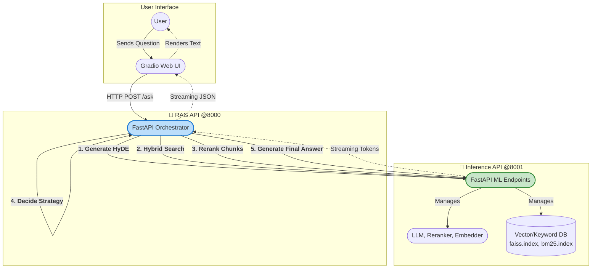

# Decoupled Adaptive RAG Engine

[](https://github.com/KareemSayed1232/Decoupled-Adaptive-Rag-Engine/blob/main/LICENSE)
[](https://www.python.org/downloads/)
[](https://github.com/psf/black)
[](https://github.com/KareemSayed1232/Decoupled-Adaptive-Rag-Engine/stargazers)

A powerful, adaptive Retrieval-Augmented Generation (RAG) system built with a decoupled microservices architecture. This project separates core AI/ML inference tasks from business logic, creating a scalable, maintainable, and developer-friendly solution.

---

## Table of Contents

- [Project Philosophy](#project-philosophy)
- [Key Features](#key-features)
- [How It Works: The RAG Pipeline](#how-it-works-the-rag-pipeline)
- [Architecture Overview](#architecture-overview)
- [Technology Stack](#technology-stack)
- [Getting Started on Windows](#getting-started-on-windows)
  - [Prerequisites](#prerequisites)
  - [Step 1: System-Level Setup (C++ & CUDA)](#step-1-system-level-setup-c--cuda)
  - [Step 2: Project & Environment Setup](#step-2-project--environment-setup)
  - [Step 3: Install GPU-Accelerated Libraries](#step-3-install-gpu-accelerated-libraries)
  - [Step 4: Configure the Project](#step-4-configure-the-project)
  - [Step 5: Install Dependencies & Build Artifacts](#step-5-install-dependencies--build-artifacts)
  - [Step 6: Run the Application](#step-6-run-the-application)
- [Project Structure](#project-structure)
- [Contributing](#contributing)
- [License](#license)
- [Contact](#contact)

## Project Philosophy

The core idea is to **decouple AI from logic**. In many projects, ML inference code is tangled with application logic (data processing, routing, state management). This project avoids that by splitting the system into two main services:

1.  **RAG API (The Orchestrator):** A lightweight service that manages the RAG pipeline, handles business logic, and communicates with the UI. It knows *what* to do.
2.  **Inference API (The Muscle):** A dedicated, heavy-duty service that runs all the demanding ML models (LLMs, Embedders, Rerankers). It knows *how* to do it.

This separation provides immense benefits in scalability, independent development, and easier maintenance.

## Key Features

-   **Fully Decoupled Services**: Scale, develop, and deploy the UI, logic, and ML services independently.
-   **Real-Time Streaming**: Delivers responses token-by-token for a dynamic and interactive user experience.
-   **Adaptive Context Strategy**: Intelligently decides how to use retrieved information based on confidence scores to prevent hallucinations.
-   **Advanced RAG Pipeline**: Incorporates HyDE, Hybrid Search, and Cross-Encoder Reranking for highly accurate and relevant results.
-   **Clean API Design**: Uses Pydantic for data validation and a shared data models package for type-safe communication between services.

## How It Works: The RAG Pipeline

This engine employs a multi-stage process to generate the most accurate answers possible.

1.  **Query Expansion with HyDE**: The user's query is first sent to a small LLM to generate a hypothetical document. This enriches the query's semantic meaning, leading to better search results.
2.  **Hybrid Search**: The system performs two types of search in parallel:
    *   **Dense Search (FAISS):** Finds documents that are semantically similar in meaning.
    *   **Sparse Search (BM25):** Finds documents that match specific keywords.
3.  **Cross-Encoder Reranking**: The results from both searches are passed to a powerful cross-encoder model. It directly compares the original query against each retrieved document to calculate a precise relevance score, filtering out noise and promoting the best context.
4.  **Adaptive Context Strategy**: Based on the top reranker score, the engine makes a smart decision:
    *   **High Confidence:** Provide a rich, detailed context to the LLM.
    *   **Medium Confidence:** Summarize the retrieved documents to distill key facts.
    *   **Low Confidence:** Reject the context entirely to avoid making things up (hallucinating).
5.  **Final Generation**: The curated context and original query are sent to the primary LLM to generate the final, streamed answer.

## Architecture Overview

The microservices pattern ensures a clear separation of concerns. The user interacts with a web client, which communicates with the RAG API (orchestrator). This API, in turn, offloads all heavy ML computations to the dedicated Inference API.



## Technology Stack

| Category                  | Technology / Library                                                              | Purpose                                                               |
|---------------------------|-----------------------------------------------------------------------------------|-----------------------------------------------------------------------|
| **Backend & API**         | `FastAPI`, `Uvicorn`                                                              | Building high-performance, asynchronous APIs for both services.       |
| **AI / Machine Learning** | `llama-cpp-python`, `Sentence Transformers`, `mxbai-rerank`, `Transformers`       | Running the LLM, generating embeddings, and reranking documents.      |
| **Vector & Keyword Search** | `Faiss`, `rank_bm25`                                                              | Performing efficient similarity and keyword-based retrieval.          |
| **Frontend / UI**         | `Gradio`                                                                          | Creating a rapid, interactive web interface.                          |
| **Data & Configuration**  | `Pydantic`, `pydantic-settings`                                                   | Data validation, type safety, and environment configuration.          |
| **Communication**         | `HTTPX`                                                                           | Asynchronous HTTP client for inter-service communication.             |

## Getting Started on Windows

This guide provides a detailed process to ensure a smooth setup on a Windows machine with an NVIDIA GPU.

### Prerequisites

-   An **NVIDIA GPU** with CUDA support.
-   **Git**: [Download here](https://git-scm.com/download/win).
-   **Miniconda**: [Download here](https://docs.anaconda.com/free/miniconda/miniconda-install/).
-   **Python 3.11** (will be installed via Conda).

### Step 1: System-Level Setup (C++ & CUDA)

Correctly installing the C++ compiler and CUDA Toolkit is the most critical step to avoid compilation errors.

#### 1. Install Visual Studio 2022

`llama-cpp-python` requires a C++ compiler to be built from source if a pre-built wheel isn't used.
1.  Download the **Visual Studio 2022 Community** installer from the [official website](https://visualstudio.microsoft.com/downloads/).
2.  Run the installer. On the **Workloads** tab, select **"Desktop development with C++"**.
3.  **CRITICAL STEP:** Go to the **Individual components** tab. Search for and select an older C++ toolset for maximum compatibility. A good choice is **"MSVC v143 - VS 2022 C++ x64/x86 build tools (v14.38...)"**. This ensures that even if CUDA doesn't support the absolute latest compiler, a compatible one is available, preventing common build failures.
4.  Click **Install** and wait for the process to complete.  

**CRITICAL NOTE:** Only after visual studio is fully installed you can proceed for the next steps

#### 2. Install NVIDIA CUDA Toolkit


1.  Check your NVIDIA driver's supported CUDA version by opening PowerShell and running `nvidia-smi`.
2.  Download the matching **CUDA Toolkit** from the [NVIDIA Developer website](https://developer.nvidia.com/cuda-toolkit-archive).
3.  Run the installer. When prompted, choose the **Custom (Advanced)** installation.
4.  Ensure that **"Visual Studio Integration"** is checked. This is crucial for the toolkit to find your C++ compiler.
5.  Rebooting the system is required after the installtion.

### Step 2: Project & Environment Setup

1.  **Clone the Repository:**
    ```bash
    git clone https://github.com/KareemSayed1232/Decoupled-Adaptive-Rag-Engine.git
    cd Decoupled-Adaptive-Rag-Engine
    ```

2.  **Create and Activate Conda Environment:**
    ```bash
    conda create -n rag_env python=3.11 -y
    conda activate rag_env
    ```

### Step 3: Install GPU-Accelerated Libraries

These packages need to be installed carefully to enable GPU acceleration.

#### 1. Install PyTorch with CUDA Support

1.  Go to the [PyTorch website](https://pytorch.org/get-started/locally/) and find the installation command for your specific system (select Pip, your OS, and your CUDA version).
2.  Run the command with the cuda version:
    ```python
    pip install torch torchvision torchaudio --index-url https://download.pytorch.org/whl/[YOUR CUDA VERSION]

    # (for example if you have cuda 12.4)
    # pip install torch torchvision torchaudio --index-url https://download.pytorch.org/whl/cu124
    
    ```
3.  **Verify:** `python -c "import torch; print(f'PyTorch CUDA available: {torch.cuda.is_available()}')"`
    > You should see: `PyTorch CUDA available: True`

#### 2. Install `llama-cpp-python` with **CUDA Support**


**Always try Option 1 first**. It's the fastest and easiest method.

<details>
<summary><strong>Option 1: Install Pre-built Wheel (Recommended)</strong></summary>

The library maintainers at [pypi](https://pypi.org/project/llama-cpp-python/) provide *Pre-built Wheel* for multiple CUDA versions.

**“It is recommended to follow the official instructions and use the recommended CUDA versions to ensure compatibility and avoid errors.”**

1.  Currently to Install the package, telling pip to look for the correct pre-built wheel. **Replace `cu124` below with your CUDA version** (e.g., `cu124`, `cu125`).
    ```python
    # Example for CUDA 12.4
    pip install llama-cpp-python --extra-index-url https://abetlen.github.io/llama-cpp-python/whl/cu124```

2.  If this command succeeds without errors, you are done with this step.

</details>

<details>
<summary><strong>Option 2: Compile from Source (Fallback Method)</strong></summary>

Use this method **only if Option 1 fails** or if a pre-built wheel is not available for your CUDA version. This uses the Visual Studio compiler we set up in Step 1.

1.  Set the necessary environment variables in a **PowerShell** terminal.
    ```powershell
    # These flags tell the installer to build with CUDA support
    $env:CMAKE_ARGS="-DGGML_CUDA=on"
    $env:FORCE_CMAKE="1"
    ```
2.  Run the installation. This will take several minutes to compile.
    ```powershell
    pip install --force-reinstall --no-cache-dir llama-cpp-python
    ```
</details>

**After completing either option, verify the installation:**
```powershell
python -c "from llama_cpp import llama_supports_gpu_offload; print(f'llama.cpp GPU offload enabled: {llama_supports_gpu_offload()}')"
```
> You should see: `llama.cpp GPU offload enabled: True`  
> *`Use Option 2 if llama.cpp GPU offload enabled: False`*

### Step 4: Configure the Project

1.  **Create `.env` file:** Create a copy of the example template.
    ```powershell
    # In PowerShell
    Copy-Item .env.example .env
    ```

2.  **Edit `.env` file:** Open the new `.env` file and update the paths to your local models and data.

    **Required Model Paths:**

    These paths **must be updated** to point to the location of your downloaded GGUF model files on your local machine.

    | Variable            | Description                                      | Example Value                               |
    |---------------------|--------------------------------------------------|---------------------------------------------|
    | `LLM_MODEL_PATH`    | Path to the main Large Language Model file.      | `data/models/guff/Qwen3-8B-Q5_K_M.gguf`       |
    | `HYDE_MODEL_PATH`   | Path to the smaller LLM used for HyDE.           | `data/models/guff/Phi-3-mini-4k-instruct-Q4_K_M.gguf` |


    **Required Data Paths:**
    | Variable | Description | Example Value |
    |---|---|---|
    | `BASE_CONTEXT_FILE` | Path to your introductory context file. | `data/base_context.txt` |
    | `COMPLETE_CONTEXT_FILE` | Path to your full knowledge base file. | `data/complete_context.txt`|

### Step 5: Install Dependencies & Build Artifacts

1.  **Install Project Python Packages:**
    ```bash
    # Install the shared data models package first
    pip install ./packages/shared-models

    # Install dependencies for each service
    pip install -r services/inference_api/requirements.txt
    pip install -r services/rag_api/requirements.txt
    pip install -r clients/gradio-demo/requirements.txt
    ```

2.  **Build Search Indexes:** This script processes your documents and creates the search artifacts.
    ```powershell
    # This environment variable can prevent a common error on Windows
    $env:KMP_DUPLICATE_LIB_OK="TRUE"

    # Run the build script
    python scripts/build_index.py
    ```  
    This will create `faiss.index` and `bm25.index` in `services/inference_api/artifacts/`.

### Step 6: Run the Application

Run each service in its **own separate terminal**. The `rag_env` conda environment must be activated in all three.

| Terminal | Service           | Commands                                                                                                                                                |
| -------- | ----------------- | ------------------------------------------------------------------------------------------------------------------------------------------------------- |
| 1        | **Inference API** | `conda activate rag_env`<br>`$env:KMP_DUPLICATE_LIB_OK="TRUE"`<br>`cd services/inference_api`<br>`uvicorn src.main:app --port 8001` |
| 2        | **RAG API**       | `conda activate rag_env`<br>`cd services/rag_api`<br>`uvicorn src.main:app --port 8000`                                                  |
| 3        | **Gradio UI**     | `conda activate rag_env`<br>`cd clients/gradio-demo`<br>`python app.py`                                                                  |

Each service must run in its **own terminal**.  
Once all services are running, open your browser and navigate to the local URL provided by Gradio (usually `http://127.0.0.1:7860`).

## Project Structure

<details>
<summary>Click to view the detailed project tree</summary>

```
.
├── clients/
│   └── gradio-demo/          # Frontend UI service
├── data/                     # Source documents and models (not in Git)
├── packages/
│   └── shared-models/        # Shared Pydantic models for type-safe APIs
├── scripts/
│   └── build_index.py        # Processes data and creates search indexes
├── services/
│   ├── inference_api/        # Handles all ML model inference
│   └── rag_api/              # Orchestrates the RAG business logic
├── .env.example              # Environment variable template
├── .gitignore
├── LICENSE
└── README.md
```
</details>

## Contributing

Contributions are welcome! Please feel free to fork the project, create a feature branch, and open a pull request.

1.  Fork the Project
2.  Create your Feature Branch (`git checkout -b feature/NewFeature`)
3.  Commit your Changes (`git commit -m 'Add some NewFeature'`)
4.  Push to the Branch (`git push origin feature/NewFeature`)
5.  Open a Pull Request

## License

Distributed under the MIT License. See `LICENSE` file for more information.

## Contact

Kareem Sayed - [LinkedIn](https://www.linkedin.com/in/kareem-sayed-dev/) - kareemsaid1232@gmail.com

Project Link: [https://github.com/KareemSayed1232/Decoupled-Adaptive-Rag-Engine](https://github.com/KareemSayed1232/Decoupled-Adaptive-Rag-Engine)