# Decoupled Adaptive RAG Engine

[](https://github.com/KareemSayed1232/Decoupled-Adaptive-Rag-Engine/blob/main/LICENSE)
[](https://www.python.org/downloads/)
[](https://github.com/psf/black)
[](https://github.com/KareemSayed1232/Decoupled-Adaptive-Rag-Engine/stargazers)

A powerful, adaptive Retrieval-Augmented Generation (RAG) system built with a decoupled microservices architecture. This project separates the core AI/ML inference tasks from the business logic, making it scalable, maintainable, and easy to develop.

## Table of Contents

- [Architecture Overview](#architecture-overview)
- [Key Features](#key-features)
- [Technology Stack](#technology-stack)
- [Getting Started](#getting-started)
  - [Prerequisites](#prerequisites)
  - [1. Clone & Configure](#1-clone--configure)
  - [2. Install Dependencies](#2-install-dependencies)
  - [3. Build Search Artifacts](#3-build-search-artifacts)
  - [4. Run the Application](#4-run-the-application)
- [Project Structure](#project-structure)
- [Contributing](#contributing)
- [License](#license)
- [Contact](#contact)

## Architecture Overview

This project implements a microservices pattern to create a clear separation of concerns. The user interacts with a web client, which communicates with an orchestration API. This API, in turn, offloads all heavy ML computations to a dedicated, independently scalable inference API.

```mermaid
flowchart TD
  %% Define subgraphs and nodes first for clarity
  subgraph UI["User Interface"]
    U(("User"))
    GD(["Gradio Web UI"])
  end

  subgraph RAG["🧠 RAG API @8000"]
    RagApp(["FastAPI Orchestrator"])
    RAG_DB[("Local Artifacts\nchunks.json")]
  end

  subgraph INF["💪 Inference API @8001"]
    IA(["FastAPI ML Endpoints"]) 
    Models(["LLM, Reranker, Embedder"])
    DB[("Vector/Keyword DB\nfaiss.index, bm25.index")]
  end

  %% Define connections between nodes
  U -- Sends Question --> GD
  GD -- HTTP POST /ask --> RagApp
  
  %% Orchestrator Logic Flow
  RagApp -- "<b>1. Preprocess Request</b>" --> IA
  RagApp -- "<b>2. Generate HyDE</b>" --> IA
  RagApp -- "<b>3. Embed Texts</b>" --> IA
  RagApp -- "<b>4. Hybrid Search</b>" --> RAG_DB
  RagApp -- "<b>5. Rerank Chunks</b>" --> IA
  RagApp -- "<b>6. Build Context</b>" --> RagApp
  RagApp -- "<b>7. Summarize (if needed)</b>" --> IA
  RagApp -- "<b>8. Generate Stream</b>" --> IA
  
  %% Internal Management in Inference API
  IA -- Manages --> Models
  IA -- Manages --> DB
  
  %% Streaming Data Flow
  U -. Streaming Response .-> GD
  RagApp -. Streaming JSON .-> GD
  IA -. Final Answer Tokens .-> RagApp

  %% Styling for Subgraphs (no rounding possible here)
  style UI fill:#fffcf2,stroke:#808080,stroke-width:1px
  style RAG fill:#e3f2fd,stroke:#1976d2,stroke-width:1px
  style INF fill:#e8f5e9,stroke:#388e3c,stroke-width:1px

  %% Styling for Nodes (ADDING ROUNDED CORNERS HERE)
  style GD rx:10px, ry:10px
  style RagApp fill:#bbdefb,stroke:#1976d2,stroke-width:2px,rx:10px,ry:10px
  style RAG_DB rx:10px, ry:10px
  style IA fill:#c8e6c9,stroke:#388e3c,stroke-width:2px,rx:10px,ry:10px
  style Models rx:10px, ry:10px
  style DB rx:10px, ry:10px
```



## Key Features

-   **Fully Decoupled Services**: Scale, develop, and deploy the UI, logic, and ML services independently.
-   **Real-Time Streaming**: Delivers responses token-by-token for a dynamic and interactive user experience.
-   **Adaptive Context Strategy**: Intelligently builds the final context for the LLM by using a reranker score threshold and on-the-fly summarization for low-confidence results.
-   **Hybrid Search**: Merges results from dense vector search (FAISS) and keyword search (BM25) to ensure robust and comprehensive document retrieval.
-   **Clean API Design**: Uses Pydantic for data validation and a shared data models package for type-safe communication between services.
-   **Developer Friendly**: Comes with a script to automate the indexing and artifact generation process.

## Technology Stack

| Category      | Technology / Library                                                              |
|---------------|-----------------------------------------------------------------------------------|
| **Backend**   | FastAPI, Uvicorn, Pydantic, HTTPX, AIOFiles                                       |
| **ML / AI**   | `llama-cpp-python`, Sentence Transformers, `mxbai-rerank`, `rank_bm25`, Transformers |
| **Vector DB** | Faiss (Facebook AI Similarity Search)                                             |
| **Frontend**  | Gradio                                                                            |
| **Language**  | Python 3.9+                                                                       |

## Getting Started

Follow these steps to get the project up and running on your local machine.

### Prerequisites

-   Python 3.9 or higher
-   Git
-   Access to a terminal or command prompt

---

### 1. Clone & Configure

First, clone the repository and navigate into the project directory.
```bash
git clone https://github.com/KareemSayed1232/Decoupled-Adaptive-Rag-Engine.git
cd Decoupled-Adaptive-Rag-Engine
```

Next, create your local environment configuration from the example file.
```bash
cp .env.example .env
```
**Important:** Open the `.env` file and update `LLM_MODEL_PATH` and `HYDE_MODEL_PATH` to point to the correct locations of your GGUF model files.

### 2. Install Dependencies

Dependencies are managed separately for each service.

```bash
# 1. Install the shared data models package
pip install -e ./packages/shared-models

# 2. Install dependencies for each service
pip install -r services/inference-api/requirements.txt
pip install -r services/rag-api/requirements.txt
pip install -r clients/gradio-demo/requirements.txt

### 3. Build Search Artifacts
Run the build script to process your source documents (`data/complete_context.md`) and create the necessary FAISS and BM25 indexes.
python scripts/build_index.py
```
This will populate the `/services/inference_api/artifacts` directory.

### 4. Run the Application

You need to run each of the three services in a **separate terminal**.

| Terminal 1: **Inference API**                  | Terminal 2: **RAG API**                         | Terminal 3: **Gradio UI**                       |
| ---------------------------------------------- | ----------------------------------------------- | ----------------------------------------------- |
| `cd services/inference-api`                    | `cd services/rag-api`                           | `cd clients/gradio-demo`                        |
| `uvicorn src.main:app --port 8001`             | `uvicorn src.main:app --port 8000`              | `python app.py`                                 |

Once all services are running, open your browser and navigate to the local URL provided by Gradio (usually `http://127.0.0.1:7860`).

## Project Structure

<details>
<summary>Click to view the detailed project tree</summary>

```
.
├── clients/gradio-demo/      # Frontend UI service
├── data/                     # Source documents and models (not in Git)
├── packages/shared-models/   # Shared Pydantic models for APIs
├── scripts/                  # Helper scripts (e.g., build_index.py)
├── services/
│   ├── inference_api/        # Handles all ML model inference
│   └── rag_api/              # Orchestrates the RAG logic
├── .env.example              # Environment variable template
├── .gitignore                # Specifies files for Git to ignore
├── LICENSE                   # Project license file
└── README.md                 # You are here!
```
</details>

## Contributing

Contributions are welcome and greatly appreciated. Please feel free to fork the project, create a feature branch, and open a pull request.

1.  Fork the Project
2.  Create your Feature Branch (`git checkout -b feature/NewFeature`)
3.  Commit your Changes (`git commit -m 'Add some NewFeature'`)
4.  Push to the Branch (`git push origin feature/NewFeature`)
5.  Open a Pull Request

## License

Distributed under the MIT License. See `LICENSE` file for more information.

## Contact

Kareem Sayed - [LinkedIn](https://www.linkedin.com/in/kareem-sayed-dev/) - kareemsayed1232@gmail.com

Project Link: [https://github.com/KareemSayed1232/Decoupled-Adaptive-Rag-Engine](https://github.com/KareemSayed1232/Decoupled-Adaptive-Rag-Engine)